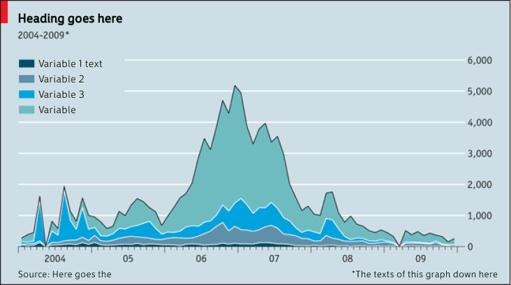
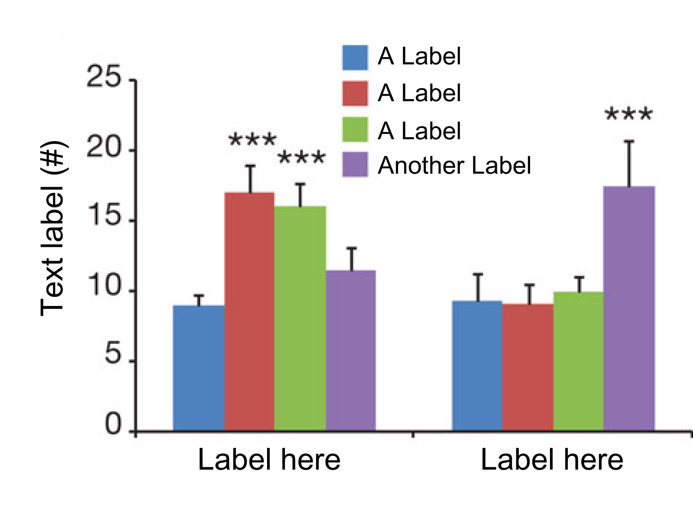
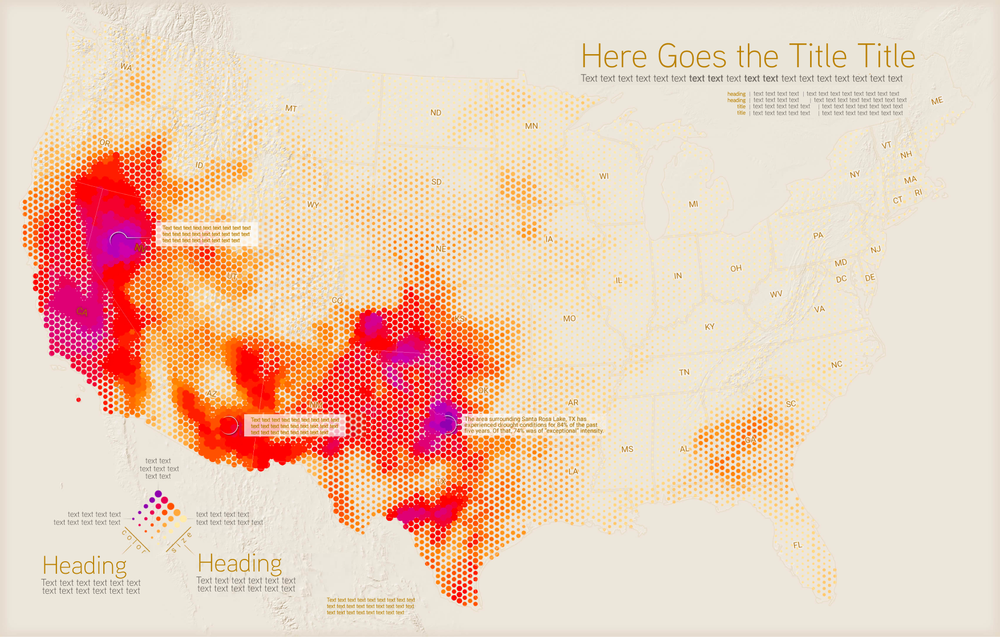
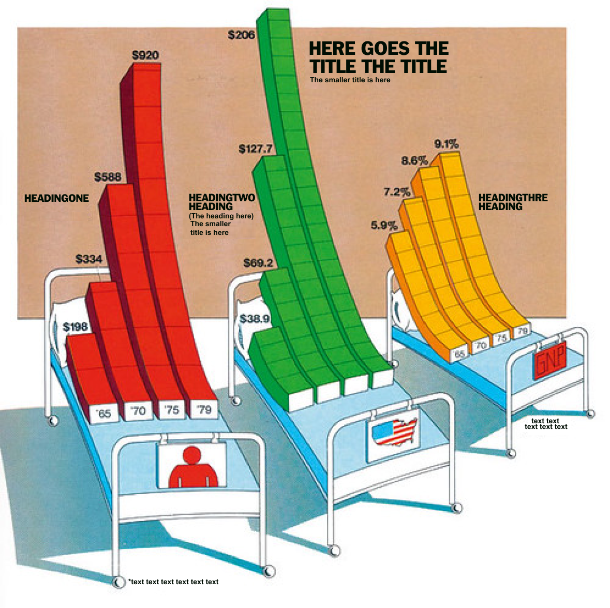

```{r setup, include=FALSE}
knitr::opts_chunk$set(echo = TRUE)

#UTILITIES
library(Hmisc) # %nin% operator
library(psych) #describe()
library(tidyverse) #all the things
library(magrittr) #special pipes like %<>%
library(summarytools) #data quality
library(lubridate) #dealing with dates

#EDA
library(qacBase)

#VIZ
library(kableExtra) #printing tables
library(ggformula) #regression syntax viz
# library(vcd) #mosaic plots
# library(vcdExtra) #mosaic plot helpers
library(ggstatsplot) #dummies
library(gghalves) #half boxplots 
library(GGally) #extends ggplot for EDA 
library(corrplot) #sophisticated correlation plots
library(ggeasy) #easy labelling
library(ggh4x) #guides [dual axes]
library(patchwork) #multi-plot layout
library(ggdist) #raincloud plots and other distributionals
library(ggridges) #ridge plots
library(viridis) #color palettes
library(RColorBrewer) #color palettes
library(plotly) # interactive graphs
library(paletteer) #more palettes
library(lessR) ##very pretty donuts 
library(ggsankey) ## ggplot2 sankey extension


#MODELLING
library(jtools) #Social Science regression utilities
library(easystats) #modelling helpers
library(see)
library(sjPlot)
library(lme4)
library(lmerTest) #for CIs in glmer
library(equatiomatic) ## extracting model formula
library(latex2exp) ## extracting and printing model formula

#CONFIG
options(readr.show_col_types = FALSE) #don't show coltypes on read_csv
n_blocks = 6

## IMPORTANT 
GRAPH_SAVE = TRUE #set to true to generate all the SD graphs and save to folders 

```

In VISUALIZATION VIBES project Study 2, participants completed an *attitutde eliciation* survey, asking questions about their attitude toward (5) stimulus images (data visualizations). Each participant was randomly assigned to one of 6 stimulus blocks, each containing 1 image from each of (4) pseudo-categories (ranging from most abstract to most figural). Each participant started by responding to questions for a single 'common' stimulus (that is thus super-powered as it was seen by all participants). Two participant recruitment pools were used: Prolific, with a smaller set of participants recruited from Tumblr (to replicate and compare survey results to Study 1 interviews with participants sourced from Tumblr).

This notebook contains code to replicate quantitative analysis of data from Study 2 reported in the CHI submission. Note that due to limited space, we were unable to report results for *all* stimulus blocks, and all possible analyses. A separate set of R notebooks are included in the supplementary materials that document analysis of the other blocks not reported here.

**This notebook includes analysis and exploration of data for stimulus block #2**

# SETUP

*We start by importing data files previously wrangled in
`0_VIBES_S2_wrangling.Rmd`.*

## Import Data

```{r import-refs, message=FALSE, warning = FALSE}

############## IMPORT REFERENCE FILES
ref_stimuli <- readRDS("data/input/REFERENCE/ref_stimuli.rds")
ref_surveys <- readRDS("data/input/REFERENCE/ref_surveys.rds")
ref_labels <- readRDS("data/input/REFERENCE/ref_labels.rds")
ref_labels_abs <- readRDS("data/input/REFERENCE/ref_labels_abs.rds")

############## SETUP Graph Labels
ref_stim_id <- levels(ref_stimuli$ID)
ref_cat_questions <- c("MAKER_ID","MAKER_AGE","MAKER_GENDER")
ref_free_response <- c("MAKER_DETAIL", "MAKER_EXPLAIN", "TOOL_DETAIL", "CHART_EXPLAIN")
ref_conf_questions <- c("MAKER_CONF", "AGE_CONF", "GENDER_CONF", "TOOL_CONF")
ref_sd_questions <- rownames(ref_labels)
ref_sd_questions_abs <- rownames(ref_labels_abs)
  

# ref_blocks <- c("block1", "block2", "block3", "block4", "block5", "block6")
ref_blocks <- c(1,2,3,4,5,6)

```

```{r import-data, message=FALSE, warning = FALSE}

############## IMPORT DATA FILES
# df_data <- readRDS("data/output/df_data.rds") #1 row per participant — WIDE
df_participants <- readRDS("data/output/df_participants.rds") #1 row per participant — demographic
df_questions <- readRDS("data/output/df_questions.rds") #1 row per question — LONG
df_sd_questions_wide <- readRDS("data/output/df_sd_questions_wide.rds") # only sd questions WIDE


df_tools <- readRDS("data/output/df_tools.rds") #multiselect format for tools Question
df_actions <- readRDS("data/output/df_actions.rds") # multiselect format for action Question
# # df_graphs_full <- readRDS("data/output/df_graphs_full.rds") #includes free response data

df_graphs <- readRDS("data/output/df_graphs.rds") #only categorical and numeric questions
df_sd_questions_long <- readRDS("data/output/df_sd_questions_long.rds") # only sd questions LONG

### DATA FILES WITH (VARIABLE-WISE) Z-SCORED SEMANTIC DIFFERENTIAL QS 
df_graphs_z <- readRDS("data/output/df_graphs_z.rds") #only categorical and numeric questions
df_sd_questions_long_z <- readRDS("data/output/df_sd_questions_long_z.rds") # only sd questions LONG


### DATA FILES WITH ABSOLUTE VALUE SEMANTIC DIFFERENTIAL QS 
df_graphs_abs <- readRDS("data/output/df_graphs_abs.rds") #only categorical and numeric questions
df_sd_questions_long_abs <- readRDS("data/output/df_sd_questions_long_abs.rds") # only sd questions LONG

```

## Set up Graphing

```{r setup-pallettes}

############## SETUP Colour Palettes
#https://www.r-bloggers.com/2022/06/custom-colour-palettes-for-ggplot2/

## list of color pallettes
my_colors = list(
  politics = c("#184aff","#5238bf", "#4f4a52" ,"#84649c", "#ff0000"),
  blackred = c("black","red"),
  greys = c("#707070","#999999","#C2C2C2"),
  greens = c("#ADC69D","#81A06D","#567E39","#2D5D16","#193E0A"),
  smallgreens = c("#ADC69D","#567E39","#193E0A"), ## MALE FEMALE OTHER
  olives = c("#CDCEA1","#B8B979","#A0A054","#78783F","#50502A","#35351C"),
  lightblues = c("#96C5D2","#61A2B2","#3C8093","#2C6378","#1F4A64"),
  darkblues = c("#7AAFE1","#3787D2","#2A73B7","#225E96","#1A4974","#133453"),
  reds = c("#D9B8BD","#CE98A2","#B17380","#954E5F","#78263E","#62151F"),
  traffic = c("#CE98A2","#81A06D","yellow"),
  questions = c("#B17380","#3787D2", "#567E39", "#EE897F"),
  tools= c("#D55662","#EE897F","#F5D0AD","#A0B79B","#499678","#2D363A"), #? ... design.....vis...... programming
  encounter = c("#8E8E8E","#729B7D"), ##SCROLL ENGAGE
  actions2 = c("#8E8E8E","#729B7D"),
  actions4 = c("#8E8E8E", "#A3A3A3","#729B7D","#499678"),
  actions3 = c("#8E8E8E","#99b898ff","#fdcea8ff"),
  actions = c("#8E8E8E","#2A363B","#99b898ff","#fdcea8ff","#ff837bff","#e84a60ff"),
  
  platforms = c("#5D93EA","#FF70CD", "#3BD3F5", "#8B69B5","black"),
  amy_gradient =  c("#ac57aa", "#9e5fa4", "#90689f", "#827099", "#747894", "#66818e", "#578988", "#499183", "#3b997d", "#2da278", "#1faa72"),
  my_favourite_colours = c("#702963", "#637029",    "#296370")
)

## function for using palettes
my_palettes = function(name, n, all_palettes = my_colors, type = c("discrete","continuous"), direction = c("1","-1")) {
  palette = all_palettes[[name]]
  if (missing(n)) {
    n = length(palette)
  }
  type = match.arg(type)
  out = switch(type,
               continuous = grDevices::colorRampPalette(palette)(n),
               discrete = palette[1:n]
  )
  out = switch(direction,
               "1" = out,
               "-1" = palette[n:1])
  structure(out, name = name, class = "palette")
}

```

```{r SD-GRAPHING-FUNCTIONS}


############## RETURNS SD STACKED AND COLORED BY BY X
## LOOP STYLE
multi_sd <- function (data, left, right, x, y, color) {

  # g <- ggplot(df, aes(y = .data[[x]], x = {{y}}, color = {{color}}))+
  g <- ggplot(data, aes(y = .data[[x]], x = .data[[y]], color = .data[[color]]))+
  geom_boxplot(width = 0.5) +
  geom_jitter(width = 0.1, alpha=0.5) +
    
  scale_y_continuous(limits=c(-1,101)) +
  labs(x="", y="") +
  coord_flip() +
  guides(
    y = guide_axis_manual(labels = left),
    y.sec = guide_axis_manual(labels = right)
  ) + theme_minimal()

  return(g)
}


############## RETURNS SINGLE SD 
## LOOP STYLE
single_sd <- function (data, left, right, x) {

  g <- ggplot(data, aes(y = {{x}}, x = ""))+
  geom_boxplot(width = 0.5) +
  geom_jitter(width = 0.1, alpha=0.5) +
  scale_y_continuous(limits=c(-1,101)) +
  labs(x="", y="") +
  coord_flip() +
  guides(
    y = guide_axis_manual(labels = left),
    y.sec = guide_axis_manual(labels = right)
  ) + theme_minimal()

  return(g)
}


# ######## RETURNS SINGLE SD
# ##  APPLY STYLE
plot_sd = function (data, column, type, mean, facet, facet_by, boxplot, labels) {

  ggplot(data, aes(y = .data[[column]], x="")) +
    {if(boxplot) geom_boxplot(width = 0.5) } +
    geom_jitter(width = 0.1, alpha=0.2, {if(facet) aes(color=.data[[facet_by]])}) +
    {if(mean)
      stat_summary(fun="mean", geom="point", shape=20, size=5, color="blue", fill="blue")
      } +
    {if(mean)
      ## assumes data has been passed in with mean column at m
      # stat_summary(fun="mean", geom="text", colour="blue",  fontface = "bold",
      #            vjust=-1.25, hjust = 0.50, aes( label=round(..y.., digits=0)))
      stat_summary(fun="mean", geom="text", colour="blue",  fontface = "bold",
                 vjust=-1.25, hjust = 0.50, aes( label=round(..y.., digits=0)))
      } +

    {if(facet) facet_grid(.data[[facet_by]] ~ .)} +
    # scale_y_continuous(limits=c(-1,101)) +
    labs(x="", y="") +
    coord_flip()  +
    {if(type == "S")
      guides(
        y = guide_axis_manual(labels = labels[column,"left"]),
        y.sec = guide_axis_manual(labels = labels[column,"right"])
      )} +
    {if(type == "Q")
      guides(
        y = guide_axis_manual(labels = labels[q,"left"]),
        y.sec = guide_axis_manual(labels = labels[q,"right"])
      )} +
  theme_minimal()  +
     labs (
       caption = column
     ) + easy_remove_legend()
}

```


# BLOCK 2 ANALYSIS

In the interest of space, for the manuscript we report analysis of one stimulus block (stimulus block == 2; pictured in the teaser image), rather than analysis of each of the six blocks. Each block contains for images, one of each "abstraction category" ranging from [1] *most abstract* (at left) to [4] *most figural* (at right). Within each block we selected visualizations such that there was diversity in: (1) chart type (2) source (i.e. where the graphic actually came from), and (3) what we as authors perceived to be aesthetic "vibe", (i.e) a diversity of what we subjectively judged to be sophisticated and unsophisticated, aesthetically pleasing, not pleasing, etc. The goal in structuring stimulus blocks was to offer each participant a set of visualizations that varied in multiple ways.

|                                         |                                                      |                                                   |                                                    |
|------------------|------------------|------------------|------------------|
| **B2-1**                                | **B2-2**                                             | **B2-3**                                          | **B2-4**                                           |
| **"Bluesy Economist Stacked Area"**     | **"Significant Excel Error Bars"**                   | **"Slick Desert Heat Map"**                       | **"Holmesian Hospital Beds"**                      |
|  | {width="117"} | {width="141"} | {width="103"} |

: BLOCK 2 STIMULI

## SAMPLE

```{r setup-block2-sample}

#block 2 participant-level data 
df_b2_p <- df_participants %>% filter(Assigned.Block ==2)

#block 2 stimulus-level data 
df_b2 <- df_graphs %>% 
  filter(str_detect(STIMULUS,"B2"))
# %>%
#   mutate(MAKER_ID = fct_rev(MAKER_ID))

```

(n = `r nrow(df_b2_p)` ) survey respondents answered questions about the (4) stimuli in block 2, yielding (o = `r nrow(df_b2)`) observations.

### Sample Demographics

```{r block2_sample-size}

df <- df_b2_p

## FOR DESCRIPTIVES PARAGRAPH
# #PROLIFIC
df.p <- df %>% filter(Distribution == "PROLIFIC")
desc.gender.p <- table(df.p$D_gender) %>% prop.table()
names(desc.gender.p) <- levels(df.p$D_gender)
p_participants <- nrow(df.p)

# #TUMBLR
df.t <- df %>% filter(Distribution == "TUMBLR")
desc.gender.t <- table(df.t$D_gender) %>% prop.table()
names(desc.gender.t) <- levels(df.t$D_gender)
t_participants <- nrow(df.t)


```

For study 2, a total of `r p_participants + t_participants` participants
were recruited from US-located English speaking users of TUMBLR (n =
`r t_participants`) and PROLIFIC (n = `r p_participants`).

`r p_participants` individuals from PROLIFIC participated in Study 2, (
`r round(desc.gender.p[["Female"]],2)*100`% Female,
`r round(desc.gender.p[["Male"]],2)*100`% Male,
`r round(desc.gender.p[["Non-binary / third gender"]],2)*100`%
Non-binary,
`r (round((desc.gender.p[["Prefer not to say"]] + desc.gender.p[["Prefer to self-describe"]]),2)) * 100`%
Other).

`r t_participants` individuals from Tumblr participated in Study 2, (
`r round(desc.gender.t[["Female"]],2)*100`% Female,
`r round(desc.gender.t[["Male"]],2)*100`% Male,
`r round(desc.gender.t[["Non-binary / third gender"]],2)*100`%
Non-binary,
`r (round((desc.gender.t[["Prefer not to say"]] + desc.gender.t[["Prefer to self-describe"]]),2)) * 100`%
Other). Note that a higher proportion of participants recruited from
TUMBLR report identities other than cis-gender Female and cis-gender
Male.

### Study Response Time

```{r demo-response-time}

df <- df_b2_p

## for descriptives paragraph
p.desc.duration <- psych::describe(df %>% filter(Distribution=="PROLIFIC") %>% pull(duration.min))
t.desc.duration <- psych::describe(df %>% filter(Distribution=="TUMBLR") %>% pull(duration.min))

```

PROLIFIC SAMPLE (n = `r p.desc.duration$n` ) participant response times
ranged from `r p.desc.duration$min` to `r p.desc.duration$max` minutes,
with a mean response time of `r round(p.desc.duration$mean,2)` minutes,
SD = `r (round(p.desc.duration$sd,2))`.

TUMBLR SAMPLE (n = `r t.desc.duration$n` ) participant response times
ranged from `r t.desc.duration$min` to `r t.desc.duration$max` minutes,
with a mean response time of `r round(t.desc.duration$mean,2)` minutes,
SD = `r (round(t.desc.duration$sd,2))`.

```{r demo-cleanup}
rm(df, df.p, df.t, p.desc.duration, t.desc.duration, desc.gender.p, desc.gender.t, p_participants, t_participants)
```

### Setup Dataframe
```{r block2_setup}

#block 2 data only
df_b2 <- df_graphs %>% filter (str_detect(STIMULUS, "B2")) %>% 
  mutate(
    STUDY = "" #dummy variable for univariate visualizations
)


```


## CONFIDENCE

Here we explore the distribution of confidence scores across the 4 stimuli 

```{r block2-confidence}

df <- df_b2  %>% select(PID, Distribution, STIMULUS, MAKER_CONF, AGE_CONF, GENDER_CONF, TOOL_CONF) %>% 
  pivot_longer(
    cols = c(MAKER_CONF, AGE_CONF, GENDER_CONF, TOOL_CONF),
    names_to = "QUESTION",
    values_to = "CONFIDENCE"
  ) %>% 
  mutate(
    QUESTION = factor(QUESTION, levels=c("MAKER_CONF","AGE_CONF","GENDER_CONF","TOOL_CONF"  ) )
  ) %>% droplevels()


## B
## CONFIDENCE ACROSS QUESTIONS (all stimuli, all Pps)
## BOXPLOT W/ JITTER
(B <- 
  df %>% ggplot(aes(x=QUESTION, y= CONFIDENCE)) + 
  geom_boxplot(width = 0.5) + 
  geom_jitter(alpha = 0.25, position=position_dodge2(width = 0.25)) + 
  stat_summary(fun=mean, geom="text", colour="blue",  fontface = "bold", 
               vjust=-2, hjust = +0.25, aes( label=round(..y.., digits=0)))+
  stat_summary(fun=mean, geom="point", size = 2, colour="blue")+
  facet_grid(. ~STIMULUS) + 
  coord_flip()+
  theme_minimal() + 
  labs(title = "BLOCK 2 Confidence by Survey Question & Stimulus", caption = "(mean in blue)")
)

## R
## CONFIDENCE ACROSS QUESTIONS (all stimuli, all Pps)
## RIDGEPLOT W/ INTERVAL MEAN
( R <-  df %>% 
  ggplot(aes(x=CONFIDENCE, y=fct_rev(QUESTION), fill=fct_rev(QUESTION))) + 
    geom_density_ridges(scale = 0.65, alpha = 0.75, quantile_lines = TRUE) +
    scale_x_continuous(limits = c(0,100))+
    scale_fill_manual(values = my_palettes(name="questions", direction = "-1"), name = "",  guide = guide_legend(reverse = TRUE)) +   
    stat_pointinterval(side = "bottom", scale = 0.7, slab_linewidth = NA, point_interval = "mean_qi") +
    stat_summary(fun=mean, geom="text", colour="blue",  fontface = "bold",
               vjust=+2, hjust = 0.40, aes( label=round(..x.., digits=0)))+
    stat_summary(fun="mean", geom="point", shape=20, size=5, color="blue", fill="blue") +
    facet_grid(.~STIMULUS) + 
  theme_minimal() + 
  labs(title = "BLOCK 2 Confidence by Survey Question", y = "QUESTION", caption =" (mean in blue)") + 
  easy_remove_legend()
)


  # GGDIST HALFEYE (raincloud doesn't work b/c long tails)
  ggplot(df, aes(y = fct_rev(STIMULUS), x = CONFIDENCE, fill = QUESTION)) +
    stat_halfeye(scale=1, density="bounded", point_interval = "mean_qi", alpha = 0.5) +
    scale_fill_manual(values = my_palettes(name="questions", direction = "-1"), name = "",  guide = guide_legend(reverse = TRUE)) +   
    # stat_interval(side = "bottom", scale = 2, slab_linewidth = NA) +  
    stat_summary(fun=mean, geom="text", colour="blue",  fontface = "bold",
                vjust=+2, hjust = 0.50, aes( label=round(..x.., digits=0)))+
    stat_summary(fun="mean", geom="point", shape=20, size=5, color="blue", fill="blue") +
    facet_grid(.~QUESTION) + 
  labs (title = "BLOCK 2 CONFIDENCE BY STIMULUS & QUESTION", y = "") +
  theme_minimal() + easy_remove_legend()
 

B
R
  

```


## MAKER QUESTIONS

### MAKER ID

Participants were asked:

**Who do you think is most likely responsible for having this image created?\
***options: [business or corporation / journalist or news outlet / educational or academic institution / government or political organization / other organization / an individual] (select one)*\
The response is stored as `MAKER_ID`

#### Maker ID by Stimulus

```{r maker-id-stimulus}

#FILTER DATASET
df <- df_b2

## A
## MAKER IDENTIFICATION BY STIMULUS AND SAMPLE
## FACETED HORIZONTAL BAR CHART 
A <- ggplot( df, aes( x = (STIMULUS), fill = MAKER_ID)) +
  geom_bar(position = "stack") +
  facet_grid( Distribution ~ ., scales = "free", space = "free") + 
  labs( title = "MAKER ID by Stimulus and SAMPLE",
        subtitle = "", x = "") +
  scale_fill_manual(values = my_palettes(name="reds", direction = "1"), name = "",  guide = guide_legend(reverse = FALSE)) +   
  # scale_fill_viridis(discrete=TRUE, option="viridis", direction = -1) +
  # coord_flip()+
  theme_minimal()
##############################


## B
## MAKER IDENTIFICATION BY STIMULUS
## GGSTATSPLOT
#hack for consistent ordering of ggstats bar plot
dx <- df %>% mutate( MAKER_ID = fct_rev(MAKER_ID) )
B <-
  ggbarstats( data = dx, 
            x = MAKER_ID, y = STIMULUS,
            legend.title = "MAKER ID",
            results.subtitle = FALSE) + 
    scale_fill_manual(values = my_palettes(name="reds", direction = "1"))+
    # scale_fill_viridis(discrete=TRUE, option="viridis", direction = -1) +
    labs( title = "MAKER ID BY STIMULUS ", subtitle = "", x = "")


##############################

## S
## MAKER ID REPEATED MEASURES
## SANKEY DIAGRAM
###FILTER FOR BLOCK 2 STIM AND RESHAPE FOR SANKEY
order <- dx$MAKER_ID %>% levels   #list order of factor levels
ds <- df_b2 %>% 
  filter(str_detect(STIMULUS, "B2")) %>% 
  select(STIMULUS, MAKER_ID, PID, Distribution) %>% 
#pivot wider 
  pivot_wider(
    names_from = STIMULUS, 
    values_from = MAKER_ID
  ) %>%
#prep for geom_sankey
  make_long(`B2-1`,`B2-2`,`B2-3`,`B2-4`) %>% 
  mutate(
    match = ifelse(node==next_node, 1, 0.5), # try to highlight throughflows
    node = factor(node, levels = order),
    next_node = factor(next_node, levels = order)
  ) 
#SANKEY DIAGRAM
S <- ggplot(ds, aes(x = x, 
               next_x = next_x, 
               node = node, 
               next_node = next_node,
               fill = node, 
               ))+
  geom_alluvial(width = 0.25, flow.alpha = 0.65, node.alpha = 1, node.color = "white") +
  geom_alluvial_text(aes( x = as.numeric(x),  label = after_stat(freq)),
          size = 3, color = "white", fontface = "bold", check_overlap = TRUE) +
  scale_fill_manual(values = my_palettes(name="reds", direction = "-1"), guide = guide_legend(reverse = TRUE)) +   
  # scale_fill_viridis(discrete=TRUE, option="viridis", drop = FALSE, alpha = 1) +
  labs(title = "MAKER ID by STIMULUS", 
       x = "STIMULUS", y = "(count)", fill = "MAKER ID",
       caption = "") + 
  theme_minimal()
 ##############################

# DISPLAY GRAPHS
A
B 
S

# CLEANUP
rm(df, ds, dx, order)

```

*To explore whether variance in maker identifications is more likely a function of participant or stimulus , we visualize the `MAKER_ID` data via an alluvial diagram. Here we see that there are **no** stable identifications (ie. paths through each stimulus with the same category) indicating that no participants had a strong preference for a particular identification category. Rather, participants seem to be identifying the maker category as a function of some features of the stimuli, rather than a trait/state inference about makers of all stimuli in general.*

#### Maker ID Confidence (distribution)

Participants were asked: **Please rate your confidence in this choice.** The response is stored as `MAKER_CONF` .

```{r maker-id-confidence}

## DESCRIBE MAKER CONFIDENCE
df <- df_b2 %>% 
  select(PID, STIMULUS, MAKER_ID, MAKER_CONF) 

desc.maker_conf <- psych::describe(df$MAKER_CONF)

## H 
## Distribution of MAKER_CONF 
## GGSTATS HISTOGRAM   
H <- gghistostats(df, x = MAKER_CONF, 
              test.value = 50,
              binwidth = 5,
              centrality.plotting = TRUE,
              centrality.type = "parametric",
              bin.args = list(color = "black", fill = "grey50", alpha = 0.2)
             ) + 
  labs(title = "Distribution of Maker ID Confidence (Block 2)",
       caption = paste0("test value = 50; sd = ", round(desc.maker_conf$sd,0))) + 
  theme_minimal()
##############################

# DISPLAY GRAPHS
H

# CLEANUP 
rm(df)
```

*Across the `r nrow(df_b2)` observations, the `r nrow(df_b2_p)` participants assigned to block 2 offered confidence values [on their maker identifications] ranging from`r desc.maker_conf$min` to `r desc.maker_conf$max` , with a mean of `r round(desc.maker_conf$mean,1)`. According to (one-sample) student's t-tests, the mean of the distribution is significantly different from both reference values of 0 (indicating no confidence) and 50% (indicating partial confidence) and 100% (indicating certainty).*

#### Maker ID Confidence (by Stimulus)

```{r, maker-id-confidence-individual, fig.width = 10}

#TEMP FILTER DATAFRAME
temp  <- df_graphs %>% 
  filter(str_detect(STIMULUS, "B2")) %>% 
  select(PID, STIMULUS, MAKER_ID, MAKER_CONF) %>% 
  group_by(PID) %>% 
  summarise(
         min = min(MAKER_CONF), 
         max = max(MAKER_CONF),
         range = max-min,
         low_var = ifelse(range < 20, TRUE, FALSE)
  )

#proportion of low variance participants 
p_lowvar <- round(nrow(temp %>% filter(low_var))/ nrow(temp)*100,0)

#FILTER DATAFRAME
df <- df_graphs %>% 
  filter(str_detect(STIMULUS, "B2")) %>% 
  select(PID, STIMULUS, MAKER_ID, MAKER_CONF) %>% 
  group_by(PID) %>% 
  mutate(
         min = min(MAKER_CONF), 
         max = max(MAKER_CONF),
         range = max-min,
         low_var = ifelse(range < 20, TRUE, FALSE))
  


## I
## MAKER CONFIDENCE (REPEATED MEASURES)
## WITHIN-SUBJECTS BOXPLOT 
I <- ggplot(df, aes(STIMULUS,MAKER_CONF)) + 
  geom_boxplot(width = 0.3)+ 
  stat_summary(fun.y="mean", geom="point", shape=20, size=5, color="blue", fill="blue") +
  stat_summary(fun.y="mean", colour="blue", geom="text", fontface = "bold", show_legend = TRUE, 
               vjust=+0.5, hjust = 1.5, aes( label=round(..y.., digits=0)))+
  geom_line(aes(group = PID, color = low_var), linetype=2, size=0.25) +
  scale_color_manual(values = my_palettes(name="blackred", type = "discrete", direction="1")) +
  geom_point(aes(group=PID), size= 2 ,alpha = 0.2) + 
  labs(
    title = "Confidence in Maker ID",
    y = "MAKER ID CONFIDENCE (%)",
    x = "Stimulus",
    subtitle = paste0("Scores range from ",desc.maker_conf$min, " to ", desc.maker_conf$max, " with ", p_lowvar,"% of ",nrow(temp)," participants (red) showing little variance in confidence across stimuli"),
    caption = "lines connect observations from the same participant 
    red indicates participants with less than 20 points range between confidence scores
    (i.e. participants whose confidence is stable, invariant across stimuli)") + 
   theme_minimal() + easy_remove_legend()
##############################


# MAKER_CONFIDENCE (VANILLA)
# ggplot(df, aes( x = (STIMULUS), y = MAKER_CONF)) + 
#   geom_boxplot(width = 0.5)+
#   geom_jitter(width = 0.10, alpha = 0.4) +
#   labs (title = "",
#         x = "", y = "MAKER ID CONFIDENCE") + 
#   theme_minimal() 

# DISPLAY GRAPHS
I

# CLEANUP
rm(df, temp)


```

*To explore whether variance in confidence in maker identification differs as a function of stimulus, or as a property of an individual subject, we visualize the distribution of confidence scores for each stimulus, where connecting lines indicate responses for a single participant. Participants with less than 20 point difference between their minimum and maximum confidence scores are indicated in red, ( `r p_lowvar` of the `r nrow(df_b2_p)` participants.) Note that the participants with low variance in confidence scores are clustered near the high end of the confidence scale, with the exception of two subjects near 50%. The mean confidence score for each stimulus (blue) is greater than 50%, and no participants indicated consistently low confidence across all stimuli, indicating that in general, participants were able to respond thoughtfully to the maker identification question.*

#### Maker ID & Confidence (by Stimulus)

```{r maker-id-confidence-stimulus}

df <- df_b2

## MC
## MAKER_CONFIDENCE by IDENTIFICATION  
## POSITION DODGE BAR PLOT
MC <- ggplot(df, aes( x = (STIMULUS), y = MAKER_CONF, color = MAKER_ID)) + 
  geom_boxplot(position=position_dodge(0.8), width = 0.5)+
  geom_jitter(position=position_jitterdodge(dodge.width = 0.8, jitter.width= 0.2, ), alpha = 0.4) +
  scale_color_manual(values = my_palettes(name="reds", direction = "1")) +   
  # scale_color_viridis(discrete=TRUE, option="viridis") +
  labs (title = "", 
        x = "", y = "Maker ID Confidence") + 
  theme_minimal() 
###################################################


# CONFIDENCE by ID
C <- ggplot(df, aes( x = (MAKER_ID), y = MAKER_CONF, color = (MAKER_ID))) + 
  geom_boxplot(position=position_dodge(0.9), width = 0.6)+
  geom_jitter(position=position_jitterdodge(), alpha = 0.2) + 
  scale_color_manual(values = my_palettes(name="reds", direction = "1"), guide = guide_legend(reverse = FALSE)) +   
  labs (x = "MAKER ID") + 
  easy_add_legend_title("MAKER ID ")+
  theme_minimal() 


# DISPLAY GRAPHS
 (p <- ( B/MC / C)  + plot_annotation(
   title = "MAKER ID & CONFIDENCE" ,
   subtitle = '',
   caption = ''))


```

```{r maker-id-cleanup}
rm(df, A, B, C, S, H, I, MC, p)
rm(desc.maker_conf, p_lowvar)
```

*Inspecting Maker ID Confidence by Maker ID category, there does not appear to be any systematic relationship between the category of Maker a participant chooses for a stimulus, and their confidence in that choice (i.e. It is not the case that identifications of `MAKER(ID) = ORGANIZATION` , for example, are made with greater or less confidence than identifications of `MAKER(ID) = INDIVIDUAL`. Statistical tests of independence (between confidence and maker id) are ill-advised because the number of observations of each maker ID vary greatly between stimuli.*

**Taken together, this analysis of correspondence between `MAKER_ID` and `MAKER_CONF` suggests that both the inference identifying the kind of maker as well as the participant's confidence in that inference are likely conditioned on some features of the *stimulus* rather than more stable state/trait(s) of the participant.**

### MAKER AGE

Participants were asked:\
Take a moment to **imagine the person(s) responsible for creating the image**. **What generation are they most likely from?\
***options: [boomers (60+ years old) / Generation X (44-59 years old) / Millennials (28-43 years old) / Generation Z (12 - 27 years old] (select one)***\
**The response was saved as `MAKER_AGE`

#### Maker AGE by Stimulus

```{r maker-age-stimulus}

#FILTER DATASET
df <- df_b2

## A
## MAKER AGE BY STIMULUS AND SAMPLE
## FACETED HORIZONTAL BAR CHART 
A <- ggplot( df, aes( x = (STIMULUS), fill = MAKER_AGE)) +
  geom_bar(position = "stack") +
  facet_grid( Distribution ~ ., scales = "free", space = "free") + 
  labs( title = "MAKER AGE by Stimulus and SAMPLE",
        subtitle = "", x = "") +
  scale_fill_manual(values = my_palettes(name="lightblues", direction = "1")) +   
    #scale_fill_viridis(discrete=TRUE, option="viridis", direction = -1) +
  # coord_flip()+
  easy_add_legend_title("") +
  theme_minimal()
##############################


## B
## MAKER AGE BY STIMULUS
## GGSTATSPLOT
#hack for consistent ordering of ggstats bar plot
dx <- df %>% mutate(MAKER_AGE = fct_rev(MAKER_AGE))
B <- ggbarstats( data = dx, 
            x = MAKER_AGE, y = STIMULUS,
            legend.title = "MAKER AGE",
            results.subtitle = FALSE)  +
    scale_fill_manual(values = my_palettes(name="lightblues", direction = "1")) +   
    # scale_fill_viridis(discrete=TRUE, option="viridis", direction = -1) +
    labs( title = "MAKER AGE BY STIMULUS ", subtitle = "", x = "")
##############################

## S
## MAKER AGE REPEATED MEASURES
## SANKEY DIAGRAM
###FILTER FOR BLOCK 2 STIM AND RESHAPE FOR SANKEY
order <- dx$MAKER_AGE %>% levels   #list order of factor levels
ds <- df_b2 %>% 
  filter(str_detect(STIMULUS, "B2")) %>% 
  select(STIMULUS, MAKER_AGE, PID, Distribution) %>% 
#pivot wider 
  pivot_wider(
    names_from = STIMULUS, 
    values_from = MAKER_AGE
  ) %>%
#prep for geom_sankey
  make_long(`B2-1`,`B2-2`,`B2-3`,`B2-4`) %>% 
  mutate(
    match = ifelse(node==next_node, 1, 0.5), # try to highlight throughflows
    node = factor(node, levels = order),
    next_node = factor(next_node, levels = order)
  ) 
#SANKEY DIAGRAM
S <- ggplot(ds, aes(x = x, 
               next_x = next_x, 
               node = node, 
               next_node = next_node,
               fill = node, 
               ))+
  geom_alluvial(width = 0.25, flow.alpha = 0.65, node.alpha = 1, node.color="white") +
  geom_alluvial_text(aes( x = as.numeric(x),  label = after_stat(freq)),
          size = 3, color = "white", fontface = "bold", check_overlap = TRUE) +
  scale_fill_manual(values = my_palettes(name="lightblues", direction = "-1"), guide = guide_legend(reverse = TRUE)) +   
  # scale_fill_viridis(discrete=TRUE, option="viridis", drop = FALSE, alpha = 1) +
  
  labs(title = "MAKER AGE by STIMULUS", 
       x = "STIMULUS", y = "(count)", fill = "MAKER AGE",
       caption = "") + 
  theme_minimal()
 ##############################

# DISPLAY GRAPHS
A
B 
S

# CLEANUP
rm(df, ds, dx, order)

```

*To explore whether variance in maker age attributions are more likely a function of participant or stimulus , we visualize the `MAKER_AGE` data via an alluvial diagram. Here we see that (unlike `MAKER_ID`) there are a number of stable identifications (ie. paths through each stimulus with the same category) indicating that some participants consistently attributed all stimuli to a particular age category. This occured most often with the 'Millenial' and 'GenX' age categories. However, this pattern may be confounded by both the true base rate of maker age (inferred based on working age of likely makers).*

#### Maker AGE Confidence (distribution)

Participants were asked: **Please rate your confidence in this choice.** The response is stored as `AGE_CONF` .

```{r maker-age-confidence}

## DESCRIBE MAKER AGE CONFIDENCE
df <- df_b2 %>% 
  select(PID, STIMULUS, MAKER_AGE, AGE_CONF) 

desc.age_conf <- psych::describe(df$AGE_CONF)

## H 
## Distribution of AGE_CONF 
## GGSTATS HISTOGRAM   
H <- gghistostats(df, x = AGE_CONF, 
              test.value = 50,
              binwidth = 5,
              centrality.plotting = TRUE,
              centrality.type = "parametric",
              bin.args = list(color = "black", fill = "grey50", alpha = 0.2)
             ) + 
  labs(title = "Distribution of Maker AGE Confidence (Block 2)",
       caption = paste0("test value = 50; sd = ", round(desc.age_conf$sd,0))) + 
  theme_minimal()
##############################

# DISPLAY GRAPHS
H

# CLEANUP 
rm(df)
```

*Across the `r nrow(df_b2)` observations, the `r nrow(df_b2_p)` participants assigned to block 2 offered confidence values [on their maker age attribution] ranging from`r desc.age_conf$min` to `r desc.age_conf$max` , with a mean of `r round(desc.age_conf$mean,1)`. According to (one-sample) student's t-tests, the mean of the distribution is significantly different from both reference values of 0 (indicating no confidence) and 50% (indicating partial confidence) and 100% (indicating certainty).*

#### Maker AGE Confidence (by Stimulus)

```{r, maker-age-confidence-individual, fig.width = 10}

#TEMP FILTER DATAFRAME
temp  <- df_graphs %>% 
  filter(str_detect(STIMULUS, "B2")) %>% 
  select(PID, STIMULUS, MAKER_AGE, AGE_CONF) %>% 
  group_by(PID) %>% 
  summarise(
         min = min(AGE_CONF), 
         max = max(AGE_CONF),
         range = max-min,
         low_var = ifelse(range < 20, TRUE, FALSE)
  )

#proportion of low variance participants 
p_lowvar <- round(nrow(temp %>% filter(low_var))/ nrow(temp)*100,0)

#FILTER DATAFRAME
df <- df_graphs %>% 
  filter(str_detect(STIMULUS, "B2")) %>% 
  select(PID, STIMULUS, MAKER_AGE, AGE_CONF) %>% 
  group_by(PID) %>% 
  mutate(
         min = min(AGE_CONF), 
         max = max(AGE_CONF),
         range = max-min,
         low_var = ifelse(range < 20, TRUE, FALSE))
  


## I
## MAKER CONFIDENCE (REPEATED MEASURES)
## WITHIN-SUBJECTS BOXPLOT 
I <- ggplot(df, aes(x = STIMULUS, y = AGE_CONF)) + 
  scale_y_continuous(limits=c(0,100))+
  geom_boxplot(width = 0.3) + 
  stat_summary(fun.y="mean", geom="point", shape=20, size=5, color="blue", fill="blue") +
  stat_summary(fun.y="mean", colour="blue", geom="text", fontface = "bold", show_legend = TRUE, 
               vjust=+0.5, hjust = 1.5, aes( label=round(..y.., digits=0)))+
  geom_line(aes(group = PID, color = low_var), linetype=2, size=0.25) +
  scale_color_manual(values = my_palettes(name="blackred", type = "discrete", direction="1"))+
  geom_point(aes(group=PID), size= 2 ,alpha = 0.2) +
  labs(
    title = "Confidence in Maker AGE",
    y = "MAKER AGE CONFIDENCE (%)",
    x = "Stimulus",
    subtitle = paste0("Scores range from ",desc.age_conf$min, " to ", desc.age_conf$max, " with ", p_lowvar,"% of ",nrow(temp)," participants (red) showing little variance in confidence across stimuli"),
    caption = "lines connect observations from the same participant 
    red indicates participants with less than 20 points range between confidence scores
    (i.e. participants whose confidence is stable, invariant across stimuli)") + 
   theme_minimal() + easy_remove_legend()
##############################


# MAKER_AGE CONFIDENCE (VANILLA)
# ggplot(df, aes( x = (STIMULUS), y = AGE_CONF)) + 
#   geom_boxplot(width = 0.5)+
#   geom_jitter(width = 0.10, alpha = 0.4) +
#   labs (title = "",
#         x = "", y = "MAKER AGE CONFIDENCE") + 
#   theme_minimal() 

# DISPLAY GRAPHS
I

# CLEANUP
rm(df, temp)


```

To explore whether variance in confidence in maker age differs as a function of stimulus, or as a property of an individual subject, we visualize the distribution of confidence scores for each stimulus, where connecting lines indicate responses for a single participant. Participants with less than 20 point difference between their minimum and maximum confidence scores are indicated in red, ( `r`\* `p_lowvar` of the `r nrow(df_b2_p)` participants.) Note that the participants with low variance in confidence scores are clustered near the high end of the confidence scale, with the exception of (2) participants who have low variance scores clustered around 50% and (2) participants clustered around 25%. The mean confidence score for each stimulus (blue) is greater than 50%, and no participants indicated consistently low confidence across all stimuli, indicating that in general, participants were able to respond thoughtfully to the maker age question.

#### Maker AGE & Confidence (by Stimulus)

```{r maker-age-confidence-stimulus}

df <- df_b2

## MC
## MAKER AGE CONFIDENCE by IDENTIFICATION  
## POSITION DODGE BAR PLOT
MC <- ggplot(df, aes( x = (STIMULUS), y = AGE_CONF, color = MAKER_AGE)) + 
  geom_boxplot(position=position_dodge(0.8), width = 0.5)+
  geom_jitter(position=position_jitterdodge(dodge.width = 0.8, jitter.width= 0.2, ), alpha = 0.4) +
  scale_color_manual(values = my_palettes(name="lightblues", direction = "1")) +   
  # scale_color_viridis(discrete=TRUE, option="viridis") +
  labs (title = "", 
        x = "", y = "Maker Age Confidence") + 
  theme_minimal() 
###################################################


# CONFIDENCE by ID
C <- ggplot(df, aes( x = (MAKER_AGE), y = AGE_CONF, color = (MAKER_AGE))) + 
  geom_boxplot(position=position_dodge(0.9), width = 0.6)+
  geom_jitter(position=position_jitterdodge(), alpha = 0.2) + 
  scale_color_manual(values = my_palettes(name="lightblues", direction = "-1"), guide = guide_legend(reverse = TRUE)) +   
  labs (x = "MAKER AGE") + 
  easy_add_legend_title("MAKER AGE")+
  theme_minimal() 


# DISPLAY GRAPHS
 (p <- ( B/MC / C)  + plot_annotation(
   title = "MAKER AGE & CONFIDENCE" ,
   subtitle = '',
   caption = ''))
```


*Inspecting Maker AGE Confidence by Maker AGE category, there does not appear to be any systematic relationship between the category of Maker AGE a participant chooses for a stimulus, and their confidence in that choice (i.e. It is not the case that identifications of `MAKER(AGE) = MILLENIAL` , for example, are made with greater or less confidence than identifications of `MAKER(AGE) = BOOMER`. Statistical tests of independence (between confidence and maker age) are ill-advised because the number of observations of each maker age vary greatly between stimuli.*

**Taken together, this analysis of correspondence between `MAKER AGE` and `MAKER AGE CONFIDENCE` suggests that both the inference identifying the age generation of maker (and the participant's confidence in that inference) are conditioned on some features of the *stimulus* rather than more stable state/trait(s) of the participant.**

```{r maker-age-cleanup}
rm(df, A, B, C, S, H, I, MC, p)
rm(desc.age_conf, p_lowvar)
```

### MAKER GENDER

Participants were asked:\
Take a moment to **imagine the person(s) responsible for creating the image**. **What gender do they most likely identify with?\
***options: [female / male / other ] (select one)***\
**Responses were stored as `MAKER_GENDER.`

#### Maker GENDER by Stimulus

```{r maker-gender-stimulus}

#FILTER DATASET
df <- df_b2

## A
## MAKER GENDER BY STIMULUS AND SAMPLE
## FACETED HORIZONTAL BAR CHART 
A <- ggplot( df, aes( x = (STIMULUS), fill = fct_rev(MAKER_GENDER))) +
  geom_bar(position = "stack") +
  facet_grid( Distribution ~ ., scales = "free", space = "free") + 
  labs( title = "MAKER GENDER by Stimulus and SAMPLE",
        subtitle = "", x = "") +
  scale_fill_manual(values = my_palettes(name="smallgreens", direction = "1")) +   
    #scale_fill_viridis(discrete=TRUE, option="viridis", direction = -1) +
  # coord_flip()+
  easy_add_legend_title("") +
  theme_minimal()
##############################


## B
## MAKER GENDER BY STIMULUS
## GGSTATSPLOT
#hack for consistent ordering of ggstats bar plot
dx <- df %>% mutate(MAKER_GENDER = (MAKER_GENDER))
B <- ggbarstats( data = dx, 
            x = MAKER_GENDER, y = STIMULUS,
            legend.title = "MAKER GENDER",
            results.subtitle = FALSE)  +
    scale_fill_manual(values = my_palettes(name="smallgreens", direction = "1")) +   
    # scale_fill_viridis(discrete=TRUE, option="viridis", direction = -1) +
    labs( title = "MAKER GENDER BY STIMULUS ", subtitle = "", x = "")
##############################

## S
## MAKER GENDER REPEATED MEASURES
## SANKEY DIAGRAM
###FILTER FOR BLOCK 2 STIM AND RESHAPE FOR SANKEY
order <- df_b2$MAKER_GENDER %>% levels   #list order of factor levels
ds <- df_b2 %>% 
  filter(str_detect(STIMULUS, "B2")) %>% 
  select(STIMULUS, MAKER_GENDER, PID, Distribution) %>% 
#pivot wider 
  pivot_wider(
    names_from = STIMULUS, 
    values_from = MAKER_GENDER
  ) %>%
#prep for geom_sankey
  make_long(`B2-1`,`B2-2`,`B2-3`,`B2-4`) %>% 
  mutate(
    match = ifelse(node==next_node, 1, 0.5), # try to highlight throughflows
    node = factor(node, levels = order),
    next_node = factor(next_node, levels = order)
  ) 
#SANKEY DIAGRAM
S <- ggplot(ds, aes(x = x, 
               next_x = next_x, 
               node = node, 
               next_node = next_node,
               fill = node, 
               ))+
  geom_alluvial(width = 0.25, flow.alpha = 0.65, node.alpha = 1, node.color="white") +
  geom_alluvial_text(aes( x = as.numeric(x),  label = after_stat(freq)),
          size = 3, color = "white", fontface = "bold", check_overlap = TRUE) +
  scale_fill_manual(values = my_palettes(name="smallgreens", direction = "-1"), guide = guide_legend(reverse = TRUE)) +   
  # scale_fill_viridis(discrete=TRUE, option="viridis", drop = FALSE, alpha = 1) +
  
  labs(title = "MAKER GENDER by STIMULUS", 
       x = "STIMULUS", y = "(count)", fill = "MAKER GENDER",
       caption = "") + 
  theme_minimal()
 ##############################

# DISPLAY GRAPHS
A
B 
S

# CLEANUP
rm(df, ds, dx, order)

```

*To explore whether variance in `MAKER_GENDER` inferences are more likely a function of participant or stimulus , we visualize the `MAKER_GENDER` data via an alluvial diagram. Here we see that (unlike `MAKER_ID`) there are a number of stable identifications (ie. paths through each stimulus with the same category) indicating that some participants consistently attributed all stimuli to a particular gender category. It is difficult to determine whether this pattern of results indicates individuals are making stable assumptions about the gender of makers independetly of stimuli (i.e. a state/trait of the participant) or alternatively, if participants are responding to the features of the stimulus and the consistency of responses across stimuli is an artifact of the limited number of gender categories. To further explore inferences about maker gender we will attend to stimuli that show large variance in distribution across gender category levels (e.g. B2-1 (vs) B2-3), especially stimuli that have a larger proportion of 'FEMALE' identifications.*

#### Maker GENDER by PARTICIPANT GENDER

```{r}

df <- df_b2

## MAKER GENDER BY STIMULUS AND PARTICIPANT GENDER
## FACETED BAR CHART 
ggplot( df, aes( x = (STIMULUS), fill = fct_rev(MAKER_GENDER))) +
  geom_bar(position = "stack") +
  facet_grid( . ~ D_gender_collapsed, scales = "free", space = "free") + 
  scale_fill_manual(values = my_palettes(name="smallgreens", direction = "1"),name = "MAKER GENDER") + 
  labs( title = "MAKER GENDER by STIMULUS and PARTICIPANT GENDER",
        subtitle = "Facet indicates participant gender", x = "STIMULUS") +
  theme_minimal()
##############################


```

*Note that the same pattern of attribution (stimuli B2-1,2 and 4 primarily male, with B2-3 a higher proportion of females), is consistent across the participant's own gender identities. It is NOT the case that female participants attribute most stimuli to women, while male participants attribute most stimuli to men. Rather, these results indicate that participants (regardless of their own gender identity) are identifying a maker's gender based on some features of the stimulus in combination with state/trait-based assumptions about maker gender identities in general. More data are needed to address this question more thoroughly.*

#### Maker GENDER Confidence (distribution)

Participants were asked: **Please rate your confidence in this choice.** The response is stored as `GENDER_CONF` .

```{r maker-gender-confidence}

## DESCRIBE MAKER GENDER CONFIDENCE
df <- df_b2 %>% 
  select(PID, STIMULUS, MAKER_GENDER, GENDER_CONF) 

desc.gender_conf <- psych::describe(df$GENDER_CONF)

## H 
## Distribution of GENDER_CONF 
## GGSTATS HISTOGRAM   
H <- gghistostats(df, x = GENDER_CONF, 
              test.value = 50,
              binwidth = 5,
              centrality.plotting = TRUE,
              centrality.type = "parametric",
              bin.args = list(color = "black", fill = "grey50", alpha = 0.2)
             ) + 
  labs(title = "Distribution of Maker GENDER Confidence (Block 2)",
       caption = paste0("test value = 50; sd = ", round(desc.gender_conf$sd,0))) + 
  theme_minimal()
##############################

# DISPLAY GRAPHS
H

# CLEANUP 
rm(df)
```

*Across the `r nrow(df_b2)` observations, the `r nrow(df_b2_p)` participants assigned to block 2 offered confidence values [on their maker gender attribution] ranging from`r desc.gender_conf$min` to `r desc.gender_conf$max` , with a mean of `r round(desc.gender_conf$mean,1)`. According to (one-sample) student's t-tests, the mean of the distribution is NOT significantly different (at the 0.01 alpha level) from both reference values of 50% (indicating partial confidence). Relative to MAKER ID and MAKER AGE, participants expressed less confidence in their attribution of MAKER GENDER*

#### Maker GENDER Confidence (by Stimulus)

```{r, maker-gender-confidence-individual, fig.width = 10}

#TEMP FILTER DATAFRAME
temp  <- df_b2 %>% 
  filter(str_detect(STIMULUS, "B2")) %>% 
  select(PID, STIMULUS, MAKER_GENDER, GENDER_CONF) %>% 
  group_by(PID) %>% 
  summarise(
         min = min(GENDER_CONF), 
         max = max(GENDER_CONF),
         range = max-min,
         low_var = ifelse(range < 20, TRUE, FALSE)
  )

#proportion of low variance participants 
p_lowvar <- round(nrow(temp %>% filter(low_var))/ nrow(temp)*100,0)

#FILTER DATAFRAME
df <- df_b2 %>% 
  filter(str_detect(STIMULUS, "B2")) %>% 
  select(PID, STIMULUS, MAKER_GENDER, GENDER_CONF) %>% 
  group_by(PID) %>% 
  mutate(
         min = min(GENDER_CONF), 
         max = max(GENDER_CONF),
         range = max-min,
         low_var = ifelse(range < 20, TRUE, FALSE))
  


## I
## MAKER GENDER CONFIDENCE (REPEATED MEASURES)
## WITHIN-SUBJECTS BOXPLOT 
I <- ggplot(df, aes(x = STIMULUS, y = GENDER_CONF)) + 
  geom_boxplot(width = 0.3) + 
  stat_summary(fun.y="mean", geom="point", shape=20, size=5, color="blue", fill="blue") +
  stat_summary(fun.y="mean", colour="blue", geom="text", fontface = "bold", show_legend = TRUE, 
               vjust=+0.5, hjust = 1.5, aes( label=round(..y.., digits=0)))+
  geom_line(aes(group = PID, color = low_var), linetype=2, size=0.25) +
  scale_color_manual(values = my_palettes(name="blackred", type = "discrete", direction="1")) +
  geom_point(aes(group=PID), size= 2 ,alpha = 0.2) +
  labs(
    title = "Confidence in Maker GENDER",
    y = "MAKER GENDER CONFIDENCE (%)",
    x = "Stimulus",
    subtitle = paste0("Scores range from ",desc.gender_conf$min, " to ", desc.gender_conf$max, " with ", p_lowvar,"% of ",nrow(temp)," participants (red) showing little variance in confidence across stimuli"),
    caption = "lines connect observations from the same participant 
    red indicates participants with less than 20 points range between confidence scores
    (i.e. participants whose confidence is stable, invariant across stimuli)") + 
   theme_minimal() + easy_remove_legend()
##############################


# MAKER_GENDER CONFIDENCE (VANILLA)
# ggplot(df, aes( x = (STIMULUS), y = GENDER_CONF)) + 
#   geom_boxplot(width = 0.5)+
#   geom_jitter(width = 0.10, alpha = 0.4) +
#   labs (title = "",
#         x = "", y = "MAKER GENDER CONFIDENCE") + 
#   theme_minimal() 

# DISPLAY GRAPHS
I

# CLEANUP
rm(df, temp)


```

*To explore whether variance in confidence in maker GENDER differs as a function of stimulus, or as a property of an individual subject, we visualize the distribution of confidence scores for each stimulus, where connecting lines indicate responses for a single participant. Participants with less than 20 point difference between their minimum and maximum confidence scores are indicated in red, ( `r`\* `p_lowvar` of the `r nrow(df_b2_p)` participants.) Note that the participants with low variance in confidence scores are not clustered near the high end of the confidence scale as with confidence in maker ID and maker AGE ... rather, low variance is maker GENDER confidence seems to be evenly distributed across the confidence scale. The mean confidence score for each stimulus (blue) are near 50%.*

**Unlike `MAKER ID` and `MAKER AGE`, confidence in `MAKER GENDER` is generally more idiosyncratic, and potentially reflective of an individual participant's state/trait inference about maker GENDER in general, rather than responding to particular features of each stimuli. To verify, we will look for stimuli that have strong patterns of difference in relative proportion of each level of the `MAKER GENDER` variable.**

#### Maker GENDER & Confidence (by Stimulus)

```{r maker-gender-confidence-stimulus}

df <- df_b2

## MC
## MAKER GENDER CONFIDENCE by IDENTIFICATION  
## POSITION DODGE BAR PLOT
MC <- ggplot(df, aes( x = (STIMULUS), y = GENDER_CONF, color = MAKER_GENDER)) + 
  geom_boxplot(position=position_dodge(0.8), width = 0.5)+
  geom_jitter(position=position_jitterdodge(dodge.width = 0.8, jitter.width= 0.2, ), alpha = 0.4) +
  scale_color_manual(values = my_palettes(name="smallgreens", direction = "-1"), guide = guide_legend(reverse = TRUE)) +   
  # scale_color_viridis(discrete=TRUE, option="viridis") +
  labs (title = "", 
        x = "", y = "Maker Gender Confidence") + 
  theme_minimal() 
###################################################


# CONFIDENCE by ID
C <- ggplot(df, aes( x = (MAKER_GENDER), y = GENDER_CONF, color = (MAKER_GENDER))) + 
  geom_boxplot(position=position_dodge(0.9), width = 0.6)+
  geom_jitter(position=position_jitterdodge(), alpha = 0.2) + 
  scale_color_manual(values = my_palettes(name="smallgreens", direction = "-1"), guide = guide_legend(reverse = TRUE)) +   
  labs (x = "MAKER GENDER") + 
  easy_add_legend_title("MAKER GENDER")+
  theme_minimal() 


# DISPLAY GRAPHS
 (p <- ( B/MC / C)  + plot_annotation(
   title = "MAKER GENDER & CONFIDENCE" ,
   subtitle = '',
   caption = ''))


```

*Inspecting `MAKER GENDER` Confidence by `MAKER GENDER` category, there does not appear to be any systematic relationship between the category of Maker GENDER a participant chooses for a stimulus, and their confidence in that choice (i.e. It is not the case that identifications of `MAKER(GENDER) = MALE` , for example, are made with greater or less confidence than identifications of `MAKER(GENDER) = FEMALE`. Statistical tests of independence (between confidence and maker age) are ill-advised because the number of observations of each maker age vary greatly between stimuli.*

**Taken together, this lack of variance in `GENDER_CONF` within-subjects and between stimuli, along with the limited number of categorical choices for the `MAKER GENDER` variable indicates that the inference identifying the gender generation of the maker (and the participant's confidence in that inference) may infact be conditioned on some relatively stable state/trait(s) of the individual participant, rather than features of the stimulus. To verify this intuition we will look for stimuli with highly variant distributions of maker gender categories. (e.g. largely female or other,rather than male)**

```{r maker-gender-cleanup}
rm(df, A, B, C, S, H, I, MC, p)
rm(desc.gender_conf, p_lowvar)
```


## TOOL QUESTIONS

### TOOL CHOICE

Participants were asked: **What tools do you think were most likely used to create this image?\
***options: [basic graphic design software (e.g. Canva, or similar) / advanced graphic design software (e.g. Adobe Illustrator, Figma, or similar) / data visualization software (e.g. Tableau, PowerBI, or similar)/ general purpose software (e.g. MS Word/Excel, Google Sheets, or similar) / programming language (e.g. R, python, javascript, or similar) ] (select all that apply)*\
The response was saved as variable `TOOL_ID` (multi-select)

#### Tool ID by Stimulus

```{r tool-id-stimulus}

#FILTER DATASET
df <- df_tools %>% filter( str_detect(STIMULUS, "B2"))

## A
## TOOL ID BY STIMULUS AND SAMPLE
## FACETED BAR CHART 
A <- ggplot(data = df, aes( fill = fct_rev(TOOL_ID), x = fct_rev(STIMULUS) )) +
  geom_bar(position = "stack") +
  # coord_flip() + 
  facet_grid(Distribution ~ ., scales = "free", space = "free") + 
  scale_fill_paletteer_d("awtools::a_palette", direction = 1)+
  # scale_y_continuous(labels = scales::percent) + 
  labs( title = "TOOL ID by Stimulus (grouped by Category)",
        subtitle = "", x = "") +
  easy_add_legend_title("TOOL_ID") +
  theme_minimal() 
##############################

## B
## TOOL ID  BY STIMULUS
## GGSTATSPLOT
#hack for consistent ordering of ggstats bar plot
# dx <- df %>% mutate( MAKER_ID = fct_rev(MAKER_ID) )
B <-ggbarstats( data = df, 
            x = TOOL_ID, y = STIMULUS,
            legend.title = "TOOL ID",
            results.subtitle = FALSE) + 
    scale_fill_paletteer_d("awtools::a_palette", direction = 1)+
    labs( title = "TOOL ID BY STIMULUS ", subtitle = "", x = "",
          caption = "note: different n across stimuli indicate answers were multiple-select")


##############################

A
B

##note: can't do sankey on tool_id because it is a multi-select field, so we can't track flow for one person through each node [stimulus]

```

#### Tool ID Confidence (distribution)

Participants were asked: **Please rate your confidence in this choice.** The response is stored as `TOOL_CONF` .

```{r tool-id-confidence}

## DESCRIBE TOOL CONFIDENCE
df <- df_tools %>% 
  filter(str_detect(STIMULUS,"B2")) %>% 
  select(PID, STIMULUS, TOOL_CONF) %>% 
  summarize( .by=c(PID,STIMULUS),
    TOOL_CONF = mean(TOOL_CONF) #this is a dummy just to collapse b/c the values will all be the same
  )

desc.tool_conf <- psych::describe(df$TOOL_CONF)

## H 
## Distribution of MAKER_CONF 
## GGSTATS HISTOGRAM   
H <- gghistostats(df, x = TOOL_CONF, 
              test.value = 50,
              binwidth = 5,
              centrality.plotting = TRUE,
              centrality.type = "parametric",
              bin.args = list(color = "black", fill = "grey50", alpha = 0.2)
             ) + 
  labs(title = "Distribution of Tool ID Confidence (Block 2)",
       caption = paste0("test value = 50; sd = ", round(desc.tool_conf$sd,0))) + 
  theme_minimal()
##############################

# DISPLAY GRAPHS
H

# CLEANUP 
rm(df)
```

*Across the `r nrow(df_b2)` observations, the `r nrow(df_b2_p)` participants assigned to block 2 offered confidence values [on their tool ID identification] ranging from`r desc.tool_conf$min` to `r desc.tool_conf$max` , with a mean of `r round(desc.tool_conf$mean,1)`. According to (one-sample) student's t-tests, the mean of the distribution is significantly different from both reference values of 0 (indicating no confidence) and 50% (indicating partial confidence) and 100% (indicating certainty). Relative to `MAKER_ID`, `MAKER_AGE` AND `MAKER_GENDER`, participants were more confident in their identification of the tools used to create a particular image.*

#### Tool ID Confidence (by Stimulus)

```{r, tool-id-confidence-individual, fig.width = 10}

#TEMP FILTER DATAFRAME
temp  <- df_tools %>% 
  filter(str_detect(STIMULUS, "B2")) %>% 
  select(PID, STIMULUS, TOOL_ID, TOOL_CONF) %>% 
  group_by(PID) %>% 
  summarise(
         min = min(TOOL_CONF), 
         max = max(TOOL_CONF),
         range = max-min,
         low_var = ifelse(range < 20, TRUE, FALSE)
  )

#proportion of low variance participants 
p_lowvar <- round(nrow(temp %>% filter(low_var))/ nrow(temp)*100,0)

#FILTER DATAFRAME
df <- df_tools %>% 
  filter(str_detect(STIMULUS, "B2")) %>% 
  select(PID, STIMULUS, TOOL_ID, TOOL_CONF) %>% 
  group_by(PID) %>% 
  mutate(
         min = min(TOOL_CONF), 
         max = max(TOOL_CONF),
         range = max-min,
         low_var = ifelse(range < 20, TRUE, FALSE))
  


## I
## MAKER GENDER CONFIDENCE (REPEATED MEASURES)
## WITHIN-SUBJECTS BOXPLOT 
I <- ggplot(df, aes(x = STIMULUS, y = TOOL_CONF)) + 
  geom_boxplot(width = 0.3) + 
  stat_summary(fun.y="mean", geom="point", shape=20, size=5, color="blue", fill="blue") +
  stat_summary(fun.y="mean", colour="blue", geom="text", fontface = "bold", show_legend = TRUE, 
               vjust=+0.5, hjust = 1.5, aes( label=round(..y.., digits=0)))+
  geom_line(aes(group = PID, color = low_var), linetype=2, size=0.25) +
  scale_color_manual(values = my_palettes(name="blackred", type = "discrete", direction="1")) +
  geom_point(aes(group=PID), size= 2 ,alpha = 0.2) +
  labs(
    title = "Confidence in TOOL",
    y = "TOOL CONFIDENCE (%)",
    x = "Stimulus",
    subtitle = paste0("Scores range from ",desc.tool_conf$min, " to ", desc.tool_conf$max, " with ", p_lowvar,"% of ",nrow(temp)," participants (red) showing little variance in confidence across stimuli"),
    caption = "lines connect observations from the same participant 
    red indicates participants with less than 20 points range between confidence scores
    (i.e. participants whose confidence is stable, invariant across stimuli)") + 
   theme_minimal() + easy_remove_legend()
##############################


# MAKER_GENDER CONFIDENCE (VANILLA)
# ggplot(df, aes( x = (STIMULUS), y = GENDER_CONF)) + 
#   geom_boxplot(width = 0.5)+
#   geom_jitter(width = 0.10, alpha = 0.4) +
#   labs (title = "",
#         x = "", y = "MAKER GENDER CONFIDENCE") + 
#   theme_minimal() 

# DISPLAY GRAPHS
I

# CLEANUP
rm(df, temp)


```

*To explore whether variance in confidence in `TOOL_ID` differs as a function of stimulus, or as a property of an individual subject, we visualize the distribution of confidence scores for each stimulus, where connecting lines indicate responses for a single participant. Participants with less than 20 point difference between their minimum and maximum confidence scores are indicated in red, ( `r`\* `p_lowvar` of the `r nrow(df_b2_p)` participants.) Note that the participants with low variance in confidence scores are clustered near the high end of the confidence scale (like the pattern of confidence in `MAKER_ID`). Across all stimuli, `TOOL_ID` confidence scores are higher than confidence for the maker identifications. The mean confidence score for each stimulus (blue) are all greater than 50%.*

**While there are some insubstantial number of participants who have low variance in tool id confidence, the range of confidence scores is smaller than those for other identifications. This makes it difficult to determine if participants have true high confidence in their choices based on each stimulus, or have some stable confidence across all stimuli.**

#### Tool ID & Confidence by Stimulus

```{r toolid-confidence-stimulus, message=FALSE, warning=FALSE, fig.width = 10}

# FILTER DATAFRAME
df <- df_tools %>% filter( str_detect(STIMULUS, "B2"))

######### TOOL ID AND CONFIDENCE ##############
a <- ggplot (df, aes( x = (STIMULUS), fill = fct_rev(TOOL_ID))) + 
  geom_bar(position = "stack", width = 0.8) +
  scale_fill_paletteer_d("awtools::a_palette", direction = 1) +
  # facet_grid( df$ENCOUNTER) + 
  labs (x = "") +
  easy_add_legend_title("TOOL ID")+
  theme_minimal() 

# TOOL_CONFIDENCE by STIMULUS
b <- ggplot(df, aes( x = (STIMULUS), y = TOOL_CONF, color = fct_rev(TOOL_ID))) + 
  geom_boxplot(position=position_dodge(0.9), width = 0.6)+
  geom_jitter(position=position_jitterdodge(), alpha = 0.2) + 
  scale_color_paletteer_d("awtools::a_palette", direction = 1) +
  labs (x = "STIMULUS") + 
  easy_add_legend_title("TOOL ID")+
  theme_minimal() 

# TOOL_CONFIDENCE by CHOICE
C <- ggplot(df, aes( x = (TOOL_ID), y = TOOL_CONF, color = fct_rev(TOOL_ID))) + 
  geom_boxplot(position=position_dodge(0.9), width = 0.6)+
  geom_jitter(position=position_jitterdodge(), alpha = 0.2) + 
  scale_color_paletteer_d("awtools::a_palette", direction = 1) +
  labs (x = "TOOL_ID") + 
  easy_add_legend_title("TOOL ID")+
  theme_minimal() 

(p <- (a / b / C )  + plot_annotation(
  title = 'TOOL ID & CONFIDENCE',
  subtitle = '',
  caption = ''))

###################################################

```

*Inspecting `TOOL_ID` Confidence by `TOOL_ID` category, there does not appear to be any systematic relationship between the category of TOOL_ID a participant chooses for a stimulus, and their confidence in that choice (i.e. It is not the case that identifications of `TOOL(ID) = DESIGN_ADVANCED` , for example, are made with greater or less confidence than identifications of `TOOL(ID) = VIZ_BASIC`. There are relatively few instances where participants chose the '?' or "unknown" option.*

```{r tool-id-cleanup}
rm(df, A, B, C, S, H, I, MC, p)
rm(desc.tool_conf, p_lowvar)
```

## BEHAVIOUR QUESTIONS

### ENCOUNTER CHOICE

Participants were asked:

**As you're scrolling through your [social media] feed, you see this image. What would you do?\
**options: [keep scrolling / pause, and look at image] (select one)**\
**The answer was stored as `ENCOUNTER`.

#### Encounter choice by Stimulus

```{r encounter-choice-stimulus}

#FILTER DATASET
df <- df_b2 

## A
## ENCOUNTER  BY STIMULUS AND SAMPLE
## FACETED HORIZONTAL BAR CHART 
A <- ggplot( df, aes( x = (STIMULUS), fill = fct_rev(ENCOUNTER))) +
  geom_bar(position = "stack") +
  facet_grid( Distribution ~ ., scales = "free", space = "free") + 
  labs( title = "ENCOUNTER by Stimulus and SAMPLE",
        subtitle = "", x = "") +
  scale_fill_manual(values = my_palettes(name="traffic", direction = "1"), name = "",  guide = guide_legend(reverse = FALSE)) +   
  # scale_fill_viridis(discrete=TRUE, option="viridis", direction = -1) +
  # coord_flip()+
  theme_minimal()
##############################


## B
## ENCOUNTER  BY STIMULUS
## GGSTATSPLOT
#hack for consistent ordering of ggstats bar plot
B <-
  ggbarstats( data = df, 
            x = ENCOUNTER, y = STIMULUS,
            legend.title = "ENCOUNTER",
            results.subtitle = FALSE) + 
    scale_fill_manual(values = my_palettes(name="traffic", direction = "1"))+
    # scale_fill_viridis(discrete=TRUE, option="viridis", direction = -1) +
    labs( title = "ENCOUNTER BY STIMULUS ", subtitle = "", x = "")


##############################

## S
## MAKER ID REPEATED MEASURES
## SANKEY DIAGRAM
###FILTER FOR BLOCK 2 STIM AND RESHAPE FOR SANKEY
order <- df %>% select(ENCOUNTER) #%>% mutate(ENCOUNTER = fct_rev(ENCOUNTER)) 
order <- order$ENCOUNTER %>% levels   #list order of factor levels
ds <- df_b2 %>% 
  filter(str_detect(STIMULUS, "B2")) %>% 
  select(STIMULUS, ENCOUNTER, PID, Distribution) %>% 
#pivot wider 
  pivot_wider(
    names_from = STIMULUS, 
    values_from = ENCOUNTER
  ) %>%
#prep for geom_sankey
  make_long(`B2-1`,`B2-2`,`B2-3`,`B2-4`) %>% 
  mutate(
    match = ifelse(node==next_node, 1, 0.5), # try to highlight throughflows
    node = factor(node, levels = order),
    next_node = factor(next_node, levels = order)
  ) 


#SANKEY DIAGRAM
S <- ggplot(ds, aes(x = x, 
               next_x = next_x, 
               node = node, 
               next_node = next_node,
               fill = fct_rev(node), 
               ))+
  geom_alluvial(width = 0.25, flow.alpha = 0.65, node.alpha = 1, node.color = "white") +
  geom_alluvial_text(aes( x = as.numeric(x),  label = after_stat(freq)),
          size = 3, color = "white", fontface = "bold", check_overlap = TRUE) +
  scale_fill_manual(values = my_palettes(name="traffic", direction = "1"), guide = guide_legend(reverse = FALSE)) +   
  # scale_fill_viridis(discrete=TRUE, option="viridis", drop = FALSE, alpha = 1) +
  labs(title = "ENCOUNTER by STIMULUS", 
       x = "STIMULUS", y = "(count)", fill = "ENCOUNTER",
       caption = "") + 
  theme_minimal()
 ##############################

# DISPLAY GRAPHS
A
B 
S

# CLEANUP
rm(df, ds, order, A,B,S)

```

### ACTION CHOICE

The final question participants were asked to answer after responding to all previous questions was:

**Now that you have encountered this image while scrolling through your social media feed, which of the following are you most likely to do?** (select all that apply)**\
***options: [post a comment / share-repost / share-repost WITH comment / look up more information about the topic or source / unfollow or block the source / NOTHING ] (select all)***\
**The answer was stored as `CHART_ACTION`.

#### Actions Choice by Stimulus

```{r action-choice-stimulus}

#FILTER DATASET
df <- df_actions %>% filter( str_detect(STIMULUS, "B2"))


## A
# ACTION CHOICE BY STIMULUS
## FACETED BAR CHART 
A <- ggplot(data = df, aes( fill = CHART_ACTION, x = fct_rev(STIMULUS) )) +
  geom_bar(position = "stack") +
  # coord_flip() + 
  facet_grid(Distribution ~ ., scales = "free", space = "free") + 
  scale_fill_paletteer_d("awtools::a_palette", direction = 1)+
  # scale_y_continuous(labels = scales::percent) + 
  labs( title = "Chart Action by Stimulus",
        subtitle = "", x = "") +
  easy_add_legend_title("ACTION") +
  theme_minimal() 
##############################


## B
## TOOL ID  BY STIMULUS
## GGSTATSPLOT
#hack for consistent ordering of ggstats bar plot
dx <- df %>% mutate( CHART_ACTION = fct_rev(CHART_ACTION) )
 B <-ggbarstats( data = dx, 
            x = CHART_ACTION, y = STIMULUS,
            legend.title = "CHART ACTION",
            results.subtitle = FALSE) + 
    scale_fill_paletteer_d("awtools::a_palette", direction = 1)+
    labs( title = "CHART ACTION BY STIMULUS ", subtitle = "", x = "",
          caption = "note: different n across stimuli indicate answers were multiple-select")
##############################

A
B

##note: can't do sankey on tool_id because it is a multi-select field, so we can't track flow for one person through each node [stimulus]

```

## SEMANTIC DIFFERENTIAL QUESTIONS


##### boxplot
```{r ALL-Q-COLLAPSED-ABS, fig.width=10, fig.height=14}


#DEFINE BLOCK 2 STIMULI
stimuli <- c("B2-1" ,"B2-2", "B2-3", "B2-4")


## LOOP THROUGH EACH STIMULUS IN LIST
i = 0

for (s in stimuli){
  i = i+1
  
  # setup dataframe 
  title <- ref_stimuli %>% filter(ID == s) %>% select(NAME)  ##TODO IF NOT WORK ref_stim_id
  title <- paste(s,"|",title)
  df <- df_graphs %>% filter(STIMULUS== s)

  
  #### BOXPLOT PLOT
  #subset data cols 
  cols <- df %>% select( all_of(ref_sd_questions))
  plots <- as.list(lapply(colnames(cols), plot_sd, data = df, type ="S", mean=TRUE, facet = FALSE, boxplot=TRUE, labels = ref_labels))

  #aggregate q plots into one for stimulus 
  x <- plots[[1]] / plots[[2]] / plots[[3]] / plots[[4]] / plots[[5]] / plots[[6]] / plots[[7]] /
   plots[[8]] /plots[[9]] /plots[[10]] /plots[[11]] + 
   plot_annotation(
     title = title,
     subtitle ="", caption = "(point is mean)")
   
  
 
if(GRAPH_SAVE){
  ggsave(plot = x, path="figs/level_block2/distributions", filename =paste0(s,"_box.png"), units = c("in"), width = 10, height = 14  )
}
  
} ## END LOOP 
```

##### ggdist halfeye
```{r plot_halfeye_sds}


#DEFINE BLOCK 2 STIMULI
stimuli <- c("B2-1" ,"B2-2", "B2-3", "B2-4")


## LOOP THROUGH EACH STIMULUS IN LIST
i = 0

for (s in stimuli){
  i = i+1
  
  # setup titles 
  title <- ref_stimuli %>% filter(ID == s) %>% select(NAME)  ##TODO IF NOT WORK ref_stim_id
  title <- paste(s,"|",title)

  # setup dataframe
  df <- df_sd_questions_long %>% select(1:8, STIMULUS, QUESTION, STIMULUS_CATEGORY, value) %>% filter(STIMULUS == s)
  d <- left_join( x = df, y = ref_labels, 
                  by = c("QUESTION" = "ref_sd_questions")) %>% 
        mutate(
               category=factor(category, levels=c("COMPETENCY","MAKER","CHART")),
          QUESTION = factor(QUESTION, levels=ref_sd_questions)) %>% 
    group_by(QUESTION) %>% 
    mutate(m=median(value)) ## calc median for printing on graph

  # GGDIST HALFEYE (raincloud doesn't work b/c long tails)
  (g <- d %>%
      ggplot(aes(y = fct_rev(QUESTION), x = value, fill=category)) +
    stat_halfeye(scale=0.8, density="bounded", point_interval = "median_qi", normalize="xy") +
    
    ## MEDIAN
    stat_summary(fun=median, geom="text", fontface = "bold", size= 2.2,
                vjust=+2, hjust = 0.50, aes(label=round(m, digits=0)))+
    stat_summary(fun=median, geom="point", size=2) +
    scale_color_manual(values = my_palettes(name="greys", direction = "1"))+
    scale_fill_manual(values = my_palettes(name="greys", direction = "1"))+
    guides(
      y = guide_axis_manual(labels = rev(ref_labels$left), title = ""),
      y.sec = guide_axis_manual(labels = rev(ref_labels$right))
    ) +
  cowplot::draw_text(text = ref_sd_questions, x = 90, y= ref_sd_questions,size = 8, vjust=-2) +
  labs (title = title, y = "", caption = "(point is median)") +
  theme_minimal() + easy_remove_legend()
)

  if(GRAPH_SAVE == TRUE){ 
  ggsave(plot = g, path="figs/level_block2/distributions", filename =paste0(s,"_ggdist.png"), units = c("in"), width = 10, height = 14  )
  }

  
} ## END LOOP 
```


##### density ridges
```{r plot_ridglines_sds}
  


#DEFINE BLOCK 2 STIMULI
stimuli <- c("B2-1" ,"B2-2", "B2-3", "B2-4")


## LOOP THROUGH EACH STIMULUS IN LIST
i = 0

for (s in stimuli){
  i = i+1
  
  # setup titles 
  title <- ref_stimuli %>% filter(ID == s) %>% select(NAME)  ##TODO IF NOT WORK ref_stim_id
  title <- paste(s,"|",title)


#### DENSITY RIDGES#############################################################################
  # setup dataframe 
  df <- df_sd_questions_long %>% select(1:8, QUESTION, STIMULUS, value)  %>% filter(STIMULUS==s)
  d <- left_join( x = df, y = ref_labels, 
                  by = c("QUESTION" = "ref_sd_questions")) %>% 
        mutate(
          category=factor(category, levels=c("COMPETENCY","MAKER","CHART")),
          QUESTION = factor(QUESTION, levels=ref_sd_questions))%>% 
    group_by(QUESTION) %>% 
    mutate(m=median(value)) ## calc median for printing on graph
  
  
(x <-
    ggplot(d, aes(x = value, y = fct_rev(QUESTION), fill = category)) +
    geom_density_ridges(scale = 0.75, quantile_lines = TRUE, alpha = 0.75, panel_scaling = TRUE) + 
    # scale_fill_manual(values = my_palettes(name="amy_gradient", direction = "1"))+ 
    scale_fill_manual(values = my_palettes(name="greys", direction = "1"))+ 
    ## MEDIAN
    stat_summary(fun=median, geom="text", fontface = "bold", size= 2.2,
                vjust=+2, hjust = 0.50, aes(label=round(m, digits=0)))+
    stat_summary(fun=median, geom="point", size=2) +
    # scale_x_continuous(limits = c(0,100))+
    guides(
      y = guide_axis_manual(labels = rev(ref_labels$left)),
      y.sec = guide_axis_manual(labels = rev(ref_labels$right))
    ) +
    labs (title = title, y = "", caption = "(point is median)") +
    cowplot::draw_text(text = ref_sd_questions, x = 100, y= ref_sd_questions,size = 8, vjust=-2, position=position_nudge(y=-.20))  + ##raw
    # cowplot::draw_text(text = ref_sd_questions, x = -4, y= ref_sd_questions,size = 10, vjust=-2) + ##z-score
    theme_minimal() + easy_remove_legend()
)

if(GRAPH_SAVE == TRUE) {
    ggsave(plot = x, path="figs/level_block2/distributions", filename =paste0(s,"_ridges.png"), units = c("in"), width = 10, height = 14  )
}

} ## END LOOP STIMULUI
```    
### DONTUS BY STIMULUS

```{r donuts-by-stimulis}

#################### ALL QUESTIONS AT STIMULUS #####################
# ONE PLOT FOR EACH STIMULUS WITH ALL QUESTIONS

#set stimuli to be graphed 
# stimuli <- ref_stimuli #created in wrangling block ##TODO IF NOT WORK ref_stim_id
# stimuli <- c("B0-0","B2-1" ,"B2-2", "B2-3", "B2-4")

#DEFINE BLOCK 2 STIMULI
stimuli <- c("B2-1" ,"B2-2", "B2-3", "B2-4")
cols = ref_cat_questions
palettes = c("reds","blues","greens")
donut_stimuli <- list()
i = 0


for (s in stimuli){
  i = i+1
  a = 0
  
  
  for (c in cols){
  a = a+1
  
  # setup title 
  title <- ref_stimuli %>% filter(ID == s) %>% select(NAME)  ##TODO IF NOT WORK ref_stim_id
  title <- paste(s,"|",title)
  
  df <- df_questions %>% filter(STIMULUS ==s) %>% filter(QUESTION==c)
  
  print(paste0(title, " | ", c))
  
  ##ONLY SAVE IF RENDER GRAPHS IF SET TO TRUE
  if(GRAPH_SAVE == TRUE){
  # CREATE A CHART TO SACE  
  lessR::PieChart(value, data = df, pdf_file = paste0("figs/level_block2/donuts/",s," ",c),
         fill = palettes[a], quiet=TRUE,
         main = paste0(s, " ",c)) 
  }
  
  # CREATE A CHART TO DISPLAY 
  ## because lessR is DUMB and can't do both at the same time
  lessR::PieChart(value, data = df, 
         fill = palettes[a], quiet=FALSE,
         main = paste0(s, " ",c)) 
 
  }
}
  
#############################################################################


```


# STASH

wip code stash

## wip confidence modelling

```{r}
# 
# ## [test-frame] Are the confidence scores significantly different for different questions?
# ## [model-frame] Does QUESTION predict CONFIDENCE, accounting for random variance in SUBJECT and STIMULUS?
# 
# 
# ## MIXED model with random variance only at subject (not stimulus)
# mm1 <- lmer( CONFIDENCE ~ QUESTION + (1|PID), data = df)
# # summary(mm1)
# # plot(check_model(mm1))
# # pm <- model_parameters(mm1)
# # plot(pm, show_labels = TRUE, show_intercept = TRUE) + labs(title = "CONFIDENCE ~ QUESTION + (1|PID)")
# # performance(mm1)
# # report(mm1)
# 
# 
# ## MIXED model with random variance only at subject AND stimulus
# mm2 <- lmer( CONFIDENCE ~ QUESTION + (1|PID) + (1|STIMULUS), data = df)
# # summary(mm2)
# # plot(check_model(mm2))
# # pm <- model_parameters(mm2)
# # plot_model(mm2)
# # plot(pm, show_labels = TRUE, show_intercept = TRUE) + labs(title = "CONFIDENCE ~ QUESTION + (1|PID) + (1|STIMULUS)")
# # performance(mm2)
# # report(mm2)
# 
# 
# ## MIXED model with random slope for question by person and random intercept by stimulus
# mm3 <- lmer( CONFIDENCE ~ QUESTION +  (1 + QUESTION | PID) + (1|STIMULUS), data = df)
# # summary(mm3)
# # plot(check_model(mm3))
# # pm <- model_parameters(mm3)
# # plot(pm, show_labels = TRUE, show_intercept = TRUE) + labs(title = "CONFIDENCE ~ QUESTION +   (1 + QUESTION | PID) + (1|STIMULUS)")
# # performance(mm3)
# # report(mm3)
# 
# 
# ## MIXED model with STIMULUS as FIXED effect and random intercept by person
# mm4 <- lmer( CONFIDENCE ~ QUESTION + STIMULUS +  (1 | PID), data = df)
# # summary(mm4)
# # plot(check_model(mm4))
# # pm <- model_parameters(mm4)
# # plot(pm, show_labels = TRUE, show_intercept = FALSE) + labs(title = "CONFIDENCE ~ QUESTION + STIMULUS +  (1 | PID)")
# # performance(mm4)
# # report(mm4)
# 
# ## MIXED model with STIMULUS * QUESTION interaction and random intercept by person
# mm5 <- lmer( CONFIDENCE ~ QUESTION * STIMULUS +  (1 | PID), data = df)
# # summary(mm5)
# # plot(check_model(mm5))
# # pm <- model_parameters(mm5)
# # plot(pm, show_labels = TRUE, show_intercept = FALSE) + labs(title = "CONFIDENCE ~ QUESTION * STIMULUS +  (1 | PID)")
# # performance(mm5)
# # report(mm5)
# 
# 
# ## MIXED model with STIMULUS * QUESTION interaction and random intercept by person
# mmx <- lmer( CONFIDENCE ~ STIMULUS  +  (1 | PID) + (1 | QUESTION), data = df)
# # summary(mmx)
# # plot(check_model(mmx))
# # pm <- model_parameters(mmx)
# # plot(pm, show_labels = TRUE, show_intercept = FALSE) + labs(title = "CONFIDENCE ~ STIMULUS  +  (1 | PID) + (1 | QUESTION)")
# # performance(mmx)
# # report(mmx)
# 
# 
# ### COMPARE MODELS
# # compare_parameters(mm1,mm2,mm3, mm4, mm5, mmx)
# compare_performance(mm1,mm2,mm3, mm4, mm5, mmx, rank = TRUE )
# ## model 3 is the best fit, and is appropriate to the design of the study
# summary(mm3)
# report(mm3)
# # plot_model(mm3, terms = c("QUESTION", "STIMULUS"), type = "diag")
# 
# # # ## repeated measures aov
# # print("Repeated Measures ANOVA")
# # ex1 <- aov(CONFIDENCE~QUESTION+Error(PID), data=df)
# # summary(ex1)
# # report(ex1)
# 


```

## correlation plot code

```{r}
# ## SHADED CIRCLES
# corrplot(m, method = 'circle', type = 'lower', 
#          order = 'AOE', diag = FALSE,
#          insig='blank',
#          tl.col = "black")
# 
# 
# ## SHADED NUMBERS
# corrplot(m,  order = 'AOE', method = "number", 
#          diag = FALSE, type = "lower",
#          insig='blank',
#          # insig = 'label_sig', sig.level = c(0.001, 0.01, 0.05),
#          addCoef.col = '#595D60',
#          tl.pos = "ld", tl.col = "#595D60")
#          
# 
# ## SHADED SQUARED + COEFFS
# corrplot(m,  order = 'AOE', method = "circle", 
#          diag = FALSE, type = "lower",
#          insig='blank', sig.level = 0.05,
#          # insig = 'label_sig', sig.level = c(0.001, 0.01, 0.05),
#          addCoef.col = '#595D60',
#          tl.pos = "ld", tl.col = "#595D60")
#          

```

## flip some sds

```{r}


############## SETUP FOR FLIPPING SCALES ON SOME QUESTIONS TO MAKE THEM MORE READABLE
ref_sd_reordered <- c("MAKER_DATA","MAKER_DESIGN", 
                    "CHART_BEAUTY", "CHART_LIKE", 
                    "MAKER_POLITIC","MAKER_ARGUE", "MAKER_SELF", "CHART_INTENT",
                    "MAKER_ALIGN","MAKER_TRUST",
                    "CHART_TRUST")

left_reordered <- c("layperson","layperson", 
                    "NOT at all","NOT at all",
                    "left-leaning",
                    "diplomatic",
                    "altruistic",
                    "inform",    
                    "DOES share", 
                    "untrustworthy",
                    "untrustworthy")
right_reordered <- c("professional","professional",
                     "very much", "very much",          
                     "right-leaning",
                     "confrontational",
                     "selfish", 
                     "persuade",
                     "does NOT share", 
                     "trustworthy",
                     "trusthworthy")

ref_labels_reordered <- as.data.frame(cbind(left_reordered,right_reordered))
rownames(ref_labels_reordered) <- ref_sd_questions


```

## correlation matrix

```{r}
## GGALLY correlation heatmap
# ggcorr(df,
#        label = TRUE,  geom = "tile",
#        nbreaks = 5, layout.exp = 2,   
#        # label_round = 2,
#        angle = -0, hjust = 0.8, vjust = 1, size = 2.5,
#        low = "#D88585",mid = "white", high= "#6DA0D6") +
#        easy_remove_legend() + 
#   labs(title = "Correlation between SD measures", subtitle = ("pairwise; Pearson correlations"))
```

## ridgeplot with interval and mean

```{r}

# ## Does MAKER_TRUST  depend on MAKER ID?
# ##RIDGEPLOT w/ MEAN 
# answers <- levels(df$MAKER_ID)
# left <- rep(ref_labels['MAKER_TRUST','left'],  length(levels(df$MAKER_ID)))
# right <- rep(ref_labels['MAKER_TRUST','right'],  length(levels(df$MAKER_ID)))
# df %>% ggplot(aes(y = fct_rev(MAKER_ID), x= MAKER_TRUST, fill = fct_rev(MAKER_ID))) + 
#   geom_density_ridges(scale = 0.55,quantile_lines = TRUE, alpha = 0.75) + 
#   stat_dotsinterval(side = "bottom", scale = 0.7, slab_linewidth = NA, point_interval = "mean_qi") +
#   stat_summary(fun=mean, geom="text", colour="blue",  fontface = "bold", 
#                vjust=+2, hjust = 0, aes( label=round(..x.., digits=0)))+
#     stat_summary(fun="mean", geom="point", shape=20, size=5, color="blue", fill="blue") +
#   scale_fill_manual(values = my_palettes(name="reds", direction = "-1"), name = "",  guide = guide_legend(reverse = TRUE)) +   
#     guides(
#       y = guide_axis_manual(labels = left, title = ""),
#       y.sec = guide_axis_manual(labels = right)
#     ) +
#    cowplot::draw_text(text = toupper(answers), x = 10, y= answers,size = 10, vjust=-2) + 
#   labs (title = "MAKER TRUST by MAKER ID", y = "", x = "MAKER TRUST", caption="(mean in blue)") +
#   theme_minimal() + easy_remove_legend()


```

## lessR donuts

```{r b2_donuts}
##good for seeing the color schemes 
# #### DEFINE SET 
# stimulus  = "B2-1"
# df <- df_graphs %>% filter(STIMULUS == stimulus)
# 
# #### GENERATE GRAPHS
# 
#   #MAKER_ID-DONUT
#   PieChart(MAKER_ID, data = df,
#          fill = "reds",
#          main = paste0(stimulus, " MAKER ID")) + theme_minimal()
# 
# 
# #MAKER_GENDER-DONUT
# PieChart(MAKER_GENDER, data = df,
#        fill = "blues",
#        main = paste0(stimulus, " MAKER GENDER")) + theme_minimal()
# 
# 
# #MAKER_AGE-DONUT
# PieChart(MAKER_AGE, data = df,
#        fill = "olives",
#        main = paste0(stimulus, " MAKER AGE")) + theme_minimal()
# 
#   #MAKER_AGE-DONUT
#   PieChart(MAKER_ID, data = df,
#          fill = "rusts",
#          main = paste0(stimulus, " MAKER AGE")) + theme_minimal()
#   
#   #MAKER_AGE-DONUT
#   PieChart(MAKER_ID, data = df,
#          fill = "olives",
#          main = paste0(stimulus, " MAKER AGE")) + theme_minimal()
#   
#   #MAKER_AGE-DONUT
#   PieChart(MAKER_ID, data = df,
#          fill = "greens",
#          main = paste0(stimulus, " MAKER AGE")) + theme_minimal()
#   
#   #MAKER_AGE-DONUT
#   PieChart(MAKER_ID, data = df,
#          fill = "emeralds",
#          main = paste0(stimulus, " MAKER AGE")) + theme_minimal()
#   
#   #MAKER_AGE-DONUT
#   PieChart(MAKER_ID, data = df,
#          fill = "turquoises",
#          main = paste0(stimulus, " MAKER AGE")) + theme_minimal()
#   
#   #MAKER_AGE-DONUT
#   PieChart(MAKER_ID, data = df,
#          fill = "aquas",
#          main = paste0(stimulus, " MAKER AGE")) + theme_minimal()
#   
#   #MAKER_AGE-MAKER_ID
#   PieChart(MAKER_ID, data = df,
#          fill = "purples",
#          main = paste0(stimulus, " MAKER AGE")) + theme_minimal()
#   
#   #MAKER_AGE-DONUT
#   PieChart(MAKER_ID, data = df,
#          fill = "magentas",
#          main = paste0(stimulus, " MAKER AGE")) + theme_minimal()
#   
#   #MAKER_AGE-DONUT
#   PieChart(MAKER_ID, data = df,
#          fill = "violets",
#          main = paste0(stimulus, " MAKER AGE")) + theme_minimal()
#   
#   #MAKER_AGE-DONUT
#   PieChart(MAKER_ID, data = df,
#          fill = "grays",
#          main = paste0(stimulus, " MAKER AGE")) + theme_minimal()
# "reds"	h	0
# "rusts"	h	30
# "browns"	h	60
# "olives"	h	90
# "greens"	h	120
# "emeralds"	h	150
# "turquoises"	h	180
# "aquas"	h	210
# "blues"	h	240
# "purples"	h	270
# "violets"	h	300
# "magentas"	h	330
# "grays"

```

## ggplot donuts

```{r}
#   df <- df_graphs %>% filter(STIMULUS== s)
# #### CATEGORICAL DONUT PLOTS
#   #subset data cols 
#   cols <- df %>% select( all_of(ref_cat_questions))
#   
#   ggplot( df, aes( x = STIMULUS, fill = MAKER_ID)) +
#   geom_bar( position = "stack", width=1) +
#   coord_radial(theta = "y", start = 0, inner.radius = 0.5, expand=FALSE) +
#   scale_fill_manual(values = my_palettes(name="reds", direction = "1"), name = "",  guide = guide_legend(reverse = FALSE)) +   
#   labs( title = paste0(s, " MAKER ID")) +
#   theme_minimal()
#   
#   
```

## Alluvial Plots

```{r}
## EXAMPLE ALLUVIAL PLOT USING GGALUVIAL  (instead of GGSANKEY)
# https://corybrunson.github.io/ggalluvial/articles/ggalluvial.html

# #FILTER FOR BLOCK 2 STIM AND RESHAPE FOR SANKEY
# ds <- df_graphs %>% 
#   filter(str_detect(STIMULUS, "B2")) %>% 
#   select(STIMULUS, MAKER_ID, PID) %>% 
#   mutate(
#     MAKER_ID = fct_relevel(MAKER_ID, 
#               c("business","education","individual", "news","organization", "political" ))
#   )
# 
# ds %>% 
#   ggplot(aes( x = STIMULUS,
#               stratum = MAKER_ID,
#               label = MAKER_ID,
#               alluvium = PID)) +
#       stat_alluvium(aes(fill = MAKER_ID),
#                     width = 0,
#                     alpha = 1,
#                     geom = "flow")+
#       geom_stratum(width = 0.2, aes(fill= MAKER_ID))+
#       # geom_text(stat = "stratum", size = 5, angle = 90)+
#       scale_fill_viridis(discrete=TRUE, option="viridis", drop = FALSE,
#                      alpha = 1) +
#       theme_minimal()
```

# RESOURCES

-   custom color palettes: <https://www.r-bloggers.com/2022/06/custom-colour-palettes-for-ggplot2/>
-   lessR donuts <https://r-charts.com/part-whole/donut-chart/>
-   GGSANKEY <https://github.com/davidsjoberg/ggsankey>
-   GGALLUVIAL <https://corybrunson.github.io/ggalluvial/articles/ggalluvial.html>
-   variable standardization [variable (vs) participant] :<https://cran.r-project.org/web/packages/datawizard/vignettes/standardize_data.html>
-   contrasts:
-   UCLA:<https://stats.oarc.ucla.edu/r/library/r-library-contrast-coding-systems-for-categorical-variables>
-   <https://phillipalday.com/stats/lazy-contrasts.html>
-   level naming with contrasts :<https://rpubs.com/bbolker/5335>
